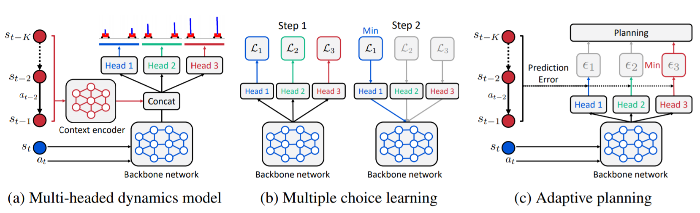

# Trajectory-wise Multiple Choice Learning for Generalization in Reinforcement Learning

TensorFlow implementation of "Trajectory-wise Multiple Choice Learning for Dynamics Generalization in Reinforcement Learning" (NeurIPS 2020).

## Method



Trajectory-wise multiple choice learning (T-MCL) learns a multi-headed dynamics model for dynamics generalization.
To effectively utilize specialized prediction heads, prediction heads are adaptively selected at evaluation time.

- [Project webpage](https://sites.google.com/view/trajectory-mcl)
- [Paper]()

## Instructions

Install required packages with below commands:

```
conda create -n tmcl python=3.6
pip install -r requirements.txt
```

Train and evaluate agents:

```
python -m run_scripts.run_tmcl --dataset [hopper/slim_humanoid/halfcheetah/cripple_ant] --normalize_flag
```

## Reference

```
@inproceedings{seo2020trajectory,
  title={Trajectory-wise Multiple Choice Learning for Dynamics Generalization in Reinforcement Learning},
  author={Seo, Younggyo and Lee, Kimin and Clavera, Ignasi and Kurutach, Thanard and Shin, Jinwoo and Abbeel, Pieter},
  booktitle={Advances in Neural Information Processing Systems},
  year={2020}
}
```